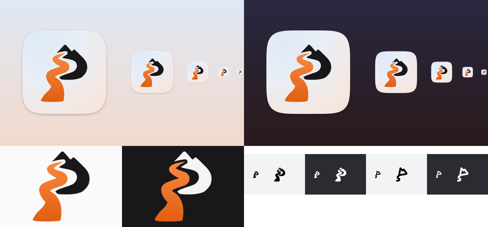

# PathKeep app icon — "Summit P", Dawn colourway

Chosen 2026-10-02. It replaces the orange square/timeline mark.

**The idea:** a capital P. Its bowl is a twin-peak mountain and its stem is a winding road that gets wider toward the viewer. It matches the tagline "Keep the path you've walked". A gap of uniform width separates the road from the mountain, so the mark still reads when drawn in one colour.

## Contents

| Path                    | What it is                                                                                               | Where it goes (as of `main`)                                             |
| ----------------------- | -------------------------------------------------------------------------------------------------------- | ------------------------------------------------------------------------ |
| `tauri/`                | Full desktop icon set made by `tauri icon` from `source/icon-1024.png`                                   | Replace the matching files in `src-tauri/icons/`                         |
| `tauri/icon.iconset/`   | Unpacked `.icns`, from 16 px to 1024 px                                                                  | Replaces `src-tauri/icons/icon.iconset/`                                 |
| `source/icon.svg`       | Master app icon: 1024 canvas, macOS squircle, soft drop shadow, hairline edge. Groups: `#bg` and `#mark` | Replaces `src-tauri/icons/icon.svg`                                      |
| `source/icon-flat.svg`  | Same icon without the shadow                                                                             | Starting point for an Icon Composer `.icon` file (macOS 26 layered icon) |
| `source/icon-1024.png`  | Raster of `icon.svg`, used to make `tauri/`                                                              | Run `bun tauri icon source/icon-1024.png` to regenerate                  |
| `source/mark-light.svg` | Mark only, for light UI: graphite mountain, orange road                                                  | `src/assets/pathkeep-mark.svg` (light theme)                             |
| `source/mark-dark.svg`  | Mark only, for dark UI: zinc-100 mountain, orange road                                                   | Dark-theme variant of the brand mark                                     |
| `source/mark-mono.svg`  | Mark only, `currentColor`                                                                                | When the mark should take the text colour                                |
| `web/favicon.svg`       | Flat app icon                                                                                            | `public/favicon.svg` (currently the stock Vite logo)                     |
| `tray/`                 | Menu-bar template glyphs (black + alpha), 18 px and @2x 36 px PNG, plus SVG                              | Future menu-bar item (see below)                                         |

`src-tauri/tauri.conf.json` already lists `icons/32x32.png`, `icons/128x128.png`, `icons/icon.icns` and `icons/icon.ico`. Those file names are unchanged, so no config edit is required. You can also add `icons/128x128@2x.png` and `icons/icon.png`, which are in `tauri/`. The `Square*Logo.png` and `StoreLogo.png` files are Windows Store tiles from the standard `tauri icon` output. Mobile icons were left out.

### Brand mark in the app

`src/components/brand-mark.tsx` imports `src/assets/pathkeep-mark.svg`, so swapping that file is enough for that component. `src/components/shell/pk-brand-mark.tsx` draws the old mark's shape inline. Its header says it mirrors the SVG exactly, so it has to be redrawn from `source/mark-*.svg`, using the two `<path>` elements `#mountain` and `#road`. In the redesign project (claude.ai/design), `assets/pathkeep-mark.svg` is also still the old mark.

### Menu-bar icon

Two template glyphs are included:

- `tray-a4-*`: recommended. It is the one-stroke "ridgeline P", with the same twin peaks and winding stem, and it stays readable at 18 pt.
- `tray-a1-*`: the filled mark. It reads at @2x but turns into a blob at @1x.

Load them as template images (Tauri `TrayIconBuilder::icon_as_template(true)`) so macOS tints them for light and dark menu bars.

## Colours (from the redesign tokens)

- Background: radial gradient at 20% / 10%, the light-theme `--wall`: `#dfe9f7` 0% → `#e9eef6` 40% → `#f7e6dc` 85% → `#f3d9cb` 100%
- Mountain: `#18181b` (`--primary`, light theme)
- Road: vertical gradient `#e15e12` (bottom) → `#f98942` (top), which brackets the brand colour `oklch(0.7 0.17 48)` ≈ `#f0772d`
- Edge: 2 px `#18181b` at 8% opacity on the squircle
- Shadow: dy 10, blur σ 12, black at 22%

## Geometry

- 1024 × 1024 canvas. The body is a superellipse (n = 5, radius 412), which gives an 824 px body with a 100 px margin, matching the macOS icon grid.
- The mark sits in its own 1024 space and is placed with `translate(512 520) scale(0.84) translate(-536 -506)`.
- All shapes are flat filled paths: no masks, no strokes in the mark, and no text.
- The generator scripts live in the main repo under `design/icon-concepts/round2/` (`a1.py` builds the paths, `trace.py` holds the raster→vector helpers).
